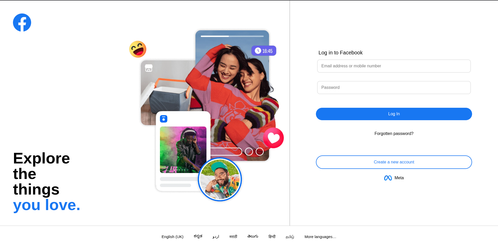

# Facebook Login Clone

A frontend clone of Facebook's login page built using HTML and CSS. The project recreates the layout, styling, and user interface of Facebook's authentication screen for learning and practice purposes.

## Features

- Facebook-inspired login interface
- Responsive layout
- Styled login form
- Create Account button
- Modern UI design
- Mobile-friendly structure

## Tech Stack

<p>
  
  
</p>

## Project Structure

```text
facebook-login-clone/
├── images/
├── style.css
├── index.html
└── README.md
```

## Running Locally

```bash
git clone <repository-url>

cd facebook-login-clone
```

Open `index.html` in a browser.

## Running Tests

No automated tests are configured for this project.

## Integration Notes

This project focuses only on frontend design and can be connected to authentication systems or backend services if needed.

### Login Page



## Live Demo

https://facebookloginclone-seven.vercel.app/

## Additional Resources

- Facebook: https://www.facebook.com/
